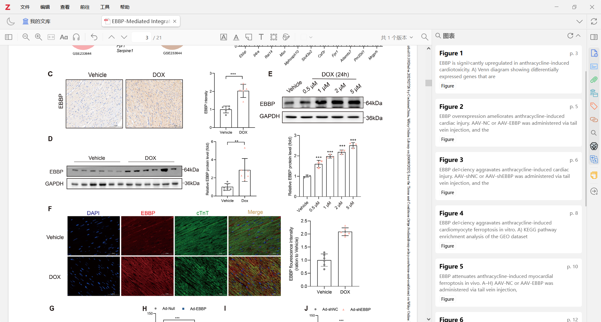
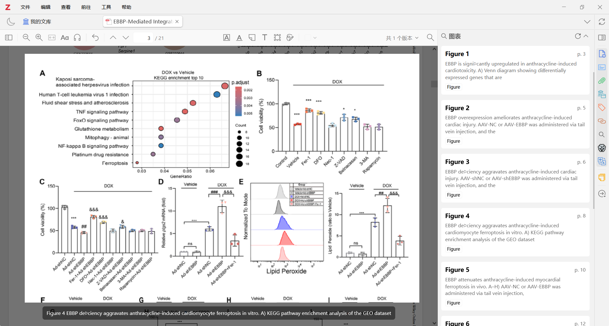
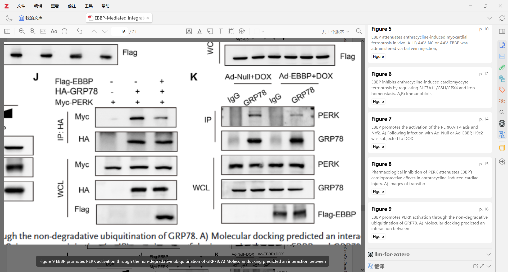

# Zotero Fig

[中文说明](README.zh-CN.md)

<p align="center">
  
</p>

Zotero Fig is a Zotero 7-9 plugin for detecting figures and tables in PDF
attachments, showing them in the reader side pane, supporting precise
navigation, and providing enlarged figure preview.

This project is based on
[windingwind/zotero-plugin-template](https://github.com/windingwind/zotero-plugin-template).

## Quick Jump

- [Screenshots](#screenshots)
- [Features](#features)
- [Requirements](#requirements)
- [Installation](#installation)
- [Usage](#usage)
- [Development](#development)
- [Known Limitations](#known-limitations)

## Screenshots

### Reader Side Pane



### Precise Navigation



### Figure Preview



## Features

- Detect figure and table captions in Zotero PDF reader
- Show detected items in the reader side pane
- Jump from the side pane to the corresponding figure or table
- Use local PyMuPDF parsing to match figure image regions with bbox data
- Open enlarged figure preview from:
  - clicking the figure in the PDF reader
  - right-clicking the figure item in the side pane
- Use mouse wheel to zoom the preview image
- Drag the preview image with left mouse button
- Close preview by clicking outside the image or pressing `Esc`

## Requirements

- Zotero `7.x` / `8.x` / `9.x`
- Python `3.x`
- PyMuPDF installed in the Python environment that Zotero Fig can find

Install PyMuPDF:

```powershell
python -m pip install PyMuPDF
```

If your system uses `py`:

```powershell
py -3 -m pip install PyMuPDF
```

## Installation

1. Build or download the plugin XPI package.
2. In Zotero, open `Tools -> Plugins`.
3. Click the gear button in the top right.
4. Choose `Install Plugin From File...`.
5. Select the generated `.xpi` file.
6. Restart Zotero if needed.

The packaged XPI is written to:

```text
.scaffold/build/zotero-fig.xpi
```

Detailed end-user installation notes are in
[doc/user-installation.md](doc/user-installation.md).

## Usage

1. Open a PDF attachment in Zotero reader.
2. Open the `Figures and Tables` side pane.
3. Left-click a side-pane item to jump to the detected figure or table.
4. Right-click a side-pane figure item to open figure preview directly.
5. Click a detected figure inside the PDF reader to open preview.
6. In preview:
   - use mouse wheel to zoom
   - drag with left mouse button to pan
   - click outside the preview to close

Notes:

- Figure preview requires bbox matching from the local PyMuPDF helper.
- If bbox is unavailable, the plugin falls back to caption-based navigation.
- Table items currently use caption-based navigation and do not have region
  preview.

## Development

Install dependencies:

```powershell
npm install
```

Configure the Zotero executable and development profile:

```powershell
Copy-Item .env.example .env
```

Then edit `.env` and set:

- `ZOTERO_PLUGIN_ZOTERO_BIN_PATH`
- `ZOTERO_PLUGIN_PROFILE_PATH`

Start the hot-reload development server:

```powershell
npm start
```

Build the plugin:

```powershell
npm run build
```

## Known Limitations

- Figure bbox matching depends on the local Python + PyMuPDF helper.
- Some PDFs may still fall back to caption-only navigation.
- Preview currently uses the rendered reader canvas as the source bitmap, so
  final sharpness depends on the current page rendering resolution.
